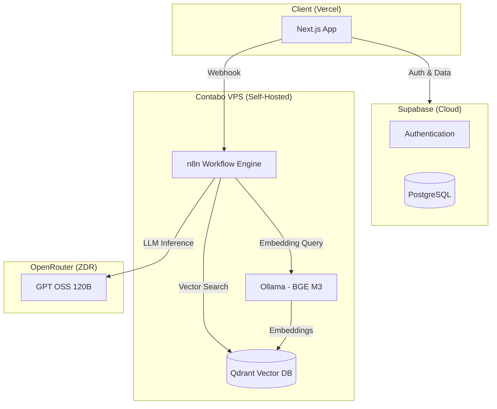

<div align="center">
  
  <h1>BAföG Bot</h1>
  <p><strong>Free AI-Powered Student Finance Assistant</strong></p>
  <p>
    <a href="#features">Features</a> •
    <a href="#architecture">Architecture</a> •
    <a href="#tech-stack">Tech Stack</a> •
    <a href="#getting-started">Getting Started</a> •
    <a href="#contributing">Contributing</a>
  </p>
  <p>
    
    
    
  </p>
</div>

---

## About

Despite generous provisions under the German **BAföG** scheme, many students fail to access financial support due to bureaucratic complexity and poor information accessibility.

**BAföG Bot** is a multilingual intelligent chatbot that uses Large Language Models together with **Retrieval-Augmented Generation (RAG)** to provide transparent and precise BAföG counseling. Developed by a Master's student team at the **University of Potsdam**, this project investigates how generative AI can simplify communication between students and public institutions.

> 📄 See [`docs/SYSTEM_PROMPT.md`](docs/SYSTEM_PROMPT.md) for our transparent AI system prompt.

---

## Features

- 🌍 **Multilingual Support** — Ask questions in any language; the bot responds in kind
- 🔍 **RAG-Powered Accuracy** — Answers grounded in authoritative BAföG documentation
- 📚 **Source Citations** — Every answer includes links to official sources
- 🧮 **Built-in Calculator** — Automatic calculations for thresholds, repayments, etc.
- 🌙 **Dark Mode** — Full light/dark theme support
- 🔐 **Secure Auth** — Supabase authentication with magic links & password login

---

## Architecture



---

## Tech Stack

| Component | Technology | Hosting |
|-----------|------------|---------|
| **Frontend** | Next.js 15, React, Tailwind CSS, shadcn/ui | Vercel |
| **Auth & Database** | Supabase (PostgreSQL + Auth) | Supabase Cloud |
| **Workflow Engine** | n8n | Self-hosted (Contabo VPS, Docker) |
| **Vector Database** | Qdrant | Self-hosted (Contabo VPS, Docker) |
| **Embedding Model** | BGE M3 via Ollama | Self-hosted (Contabo VPS, Docker) |
| **LLM** | GPT OSS 120B | OpenRouter (Zero Data Retention) |

---

## Model Papers & References

### Large Language Model
- **GPT OSS 120B** (accessed via OpenRouter ZDR providers)
  - [GPT-OSS-120B & GPT-OSS-20B Model Card](https://arxiv.org/abs/2508.10925) — OpenAI, 2025

### Embedding Model
- **BGE M3** (self-hosted via Ollama)
  - [BGE M3-Embedding: Multi-Lingual, Multi-Functionality, Multi-Granularity Text Embeddings](https://arxiv.org/abs/2402.03216) — Chen et al., 2024

### Vector Database
- **Qdrant**
  - [Qdrant Documentation](https://qdrant.tech/documentation/)
  - [GitHub Repository](https://github.com/qdrant/qdrant)

### Workflow Engine
- **n8n**
  - [n8n Documentation](https://docs.n8n.io/)
  - [GitHub Repository](https://github.com/n8n-io/n8n)

---

## Getting Started

### Prerequisites

- Node.js 18+
- npm or pnpm
- Supabase project (for auth & database)
- n8n instance with BAföG workflow configured

### Installation

```bash
# Clone the repository
git clone https://github.com/your-org/bafoeg-bot.git
cd bafoeg-bot

# Install dependencies
npm install

# Set up environment variables
cp .env.example .env.local
# Edit .env.local with your Supabase credentials and n8n webhook URL

# Run development server
npm run dev
```

Open [http://localhost:3000](http://localhost:3000) to see the app.

### Environment Variables

```env
NEXT_PUBLIC_SUPABASE_URL=your-supabase-url
NEXT_PUBLIC_SUPABASE_ANON_KEY=your-supabase-anon-key
NEXT_PUBLIC_N8N_WEBHOOK_URL=your-n8n-webhook-url
```

---

## Deployment

### Frontend (Vercel)

```bash
# Install Vercel CLI
npm i -g vercel

# Deploy
vercel
```

### Backend Services (Contabo VPS)

The following services run as Docker containers on a self-hosted Contabo VPS:

- **n8n**: Workflow automation with BAföG RAG pipeline
- **Qdrant**: Vector database storing embedded BAföG documents
- **Ollama**: Serving BGE M3 embedding model

See the infrastructure documentation for Docker Compose configuration.

---

## Contributing

We welcome contributions! Please follow these steps:

1. Fork the repository
2. Create a feature branch (`git checkout -b feature/amazing-feature`)
3. Commit your changes (`git commit -m 'Add amazing feature'`)
4. Push to the branch (`git push origin feature/amazing-feature`)
5. Open a Pull Request

### Code Style

- TypeScript strict mode
- ESLint + Prettier
- Conventional commits

---

## License

This project is licensed under the MIT License — see the [LICENSE](LICENSE) file for details.

---

## Acknowledgments

- **University of Potsdam** — Master's Program in Data Science
- **Digital Transformation in Public Administration** — Course project and guidance
- **BAföG Digital** — Source documentation
- **Open-source community** — Amazing software that makes projects like this possible!

---

<div align="center">
  <sub>Built with ❤️ by Data Science students at University of Potsdam</sub>
</div>
