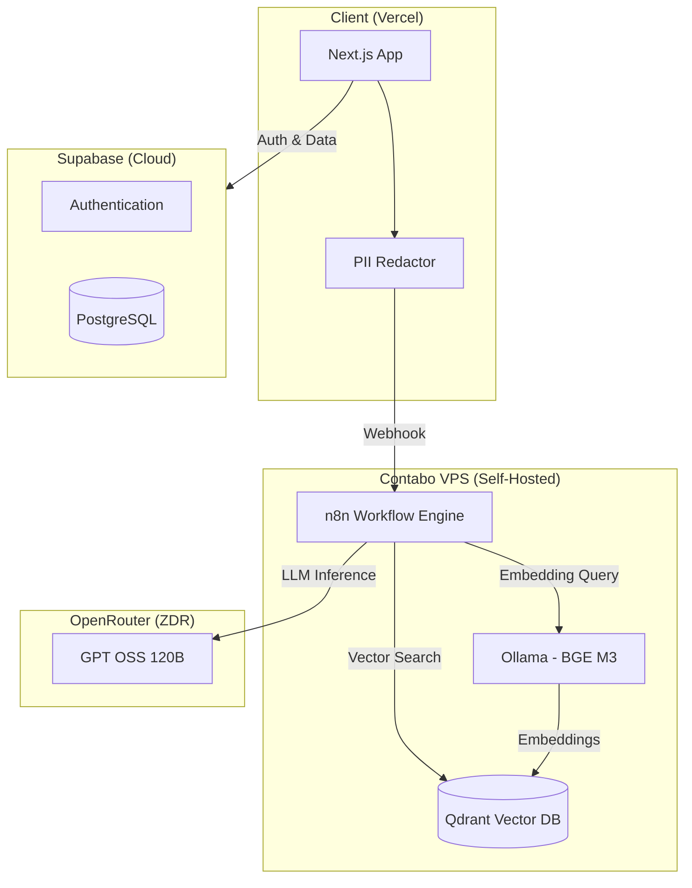

<div align="center">
  
  <h1>BAföG Bot</h1>
  <p><strong>Free AI-Powered Student Finance Assistant</strong></p>
  <p>
    <a href="#features">Features</a> •
    <a href="#architecture">Architecture</a> •
    <a href="#tech-stack">Tech Stack</a> •
    <a href="#getting-started">Getting Started</a> •
    <a href="#contributing">Contributing</a>
  </p>
  <p>
    
    
    
  </p>
</div>

---

## About

Despite generous provisions under the German **BAföG** scheme, many students fail to access financial support due to bureaucratic complexity and poor information accessibility.

**BAföG Bot** is a multilingual intelligent chatbot that uses Large Language Models together with **Retrieval-Augmented Generation (RAG)** to provide transparent and precise BAföG counseling. Developed by a Master's student team at the **University of Potsdam**, this project investigates how generative AI can simplify communication between students and public institutions.

> 📄 See [`docs/SYSTEM_PROMPT.md`](docs/SYSTEM_PROMPT.md) for our transparent AI system prompt.
> 
> 🔧 See [`n8n/`](n8n/) for the complete RAG workflow (importable JSON).

---

## Features

### Core Capabilities
- 🌍 **Multilingual Support** — Ask questions in any language; the bot responds in kind
- 🔍 **RAG-Powered Accuracy** — Answers grounded in authoritative BAföG documentation
- 📚 **Source Citations** — Every answer includes links to official law paragraphs (§) or bafög.de pages
- 🧮 **Built-in Calculator** — Transparent calculations for income thresholds, repayments, etc. (inputs visible for verification)
- 📄 **Document Upload** — Upload PDFs or images (forms, decision letters, screenshots) for assistance
- 🔐 **Privacy-First** — PII redacted server-side before processing; Zero Data Retention AI provider

### User Experience
- 🎨 **Theme Options** — Light, dark, or system theme
- 📝 **Adjustable Font Size** — Accessibility settings for better readability
- 🗣️ **Simple Language Mode** — Simplified answers for easier comprehension
- 👤 **Anonymous Mode** — Use without registration ("Try without account")
- ✨ **Magic Link Auth** — One-click email login to save and manage chats
- 📊 **Data Transparency** — Shows knowledge base version (29th BAföG Reform, July 2024)

### Tool Transparency
The bot shows which tools it uses and their inputs:
- **Qdrant Search** — Displays the exact search query sent to the knowledge base
- **Calculator** — Shows the calculation input so users can verify results

---

## Architecture



---

## Tech Stack

| Component | Technology | Hosting |
|-----------|------------|---------|
| **Frontend** | Next.js 15, React, Tailwind CSS, shadcn/ui | Vercel |
| **Auth & Database** | Supabase (PostgreSQL + Auth) | Supabase Cloud |
| **Workflow Engine** | n8n | Self-hosted (Contabo VPS, Docker) |
| **Vector Database** | Qdrant | Self-hosted (Contabo VPS, Docker) |
| **Embedding Model** | BGE M3 via Ollama | Self-hosted (Contabo VPS, Docker) |
| **LLM** | GPT OSS 120B | OpenRouter (Zero Data Retention) |

---

## Data Sources & Currency

| Source | Version | Last Verified |
|--------|---------|---------------|
| **BAföG Law** | 29. BAföGÄndG (in effect since July 2024) | January 2026 |
| **Official BAföG Info Webpages** | bafög.de content | January 2026 |
| **Income Limits** | Minijob 2026: €603/month | January 2026 |

---

## Model Papers & References

### Large Language Model
- **GPT OSS 120B** (accessed via OpenRouter ZDR providers)
  - [GPT-OSS-120B & GPT-OSS-20B Model Card](https://arxiv.org/abs/2508.10925) — OpenAI, 2025

### Embedding Model
- **BGE M3** (self-hosted via Ollama)
  - [BGE M3-Embedding: Multi-Lingual, Multi-Functionality, Multi-Granularity Text Embeddings](https://arxiv.org/abs/2402.03216) — Chen et al., 2024

### Vector Database
- **Qdrant**
  - [Qdrant Documentation](https://qdrant.tech/documentation/)
  - [GitHub Repository](https://github.com/qdrant/qdrant)

### Workflow Engine
- **n8n**
  - [n8n Documentation](https://docs.n8n.io/)
  - [GitHub Repository](https://github.com/n8n-io/n8n)

---

## Getting Started

BAföG Bot is a full-stack application consisting of three main components:
1. **Frontend**: This Next.js repository.
2. **Persistence & Auth**: A Supabase project.
3. **RAG Backend**: An n8n workflow connected to a Vector Database (Qdrant).

### Environment Setup

To run this project, you will need to create a `.env.local` file based on the provided template:

```bash
cp .env.example .env.local
```

| Variable | Description | Location |
|----------|-------------|----------|
| `NEXT_PUBLIC_SUPABASE_URL` | Your Supabase Project URL | Supabase Dashboard |
| `NEXT_PUBLIC_SUPABASE_ANON_KEY` | Your Supabase Anon Key | Supabase Dashboard |
| `N8N_WEBHOOK_URL` | The URL of your n8n webhook | n8n Workflow |
| `N8N_WEBHOOK_SECRET` | The header auth secret (`bafoeg-webhook-key`) | n8n Webhook Node |

### Local Development

Since the production RAG backend is private, you have two options for local development:

#### 1. Mock Mode (Recommended for UI/UX)
Set `MOCK_N8N=true` in your `.env.local`. This iterates on the frontend using simulated responses without needing a running backend.

#### 2. Full Stack Self-Hosting
If you wish to contribute to the RAG logic or run your own instance:
- **n8n**: Import the workflow from [`n8n/`](n8n/) directory.
- **Vector DB**: Set up a Qdrant collection and populate it with BAföG documents.
- **LLM**: Configure your own OpenRouter API key in the n8n nodes.

---

## RAG Pipeline & n8n Workflow

For full transparency, the core RAG logic is available in the [`n8n/`](n8n/) directory. This workflow handles:
- **Query Translation**: Converts user questions to German for vector search
- **Vector Search**: Queries Qdrant for relevant BAföG legislation and FAQ snippets
- **Calculator Tool**: Performs arithmetic with visible inputs for verification
- **Contextual Reasoning**: Passes retrieved context to GPT-OSS-120B via OpenRouter
- **Source Attribution**: Includes clickable links to law paragraphs and official pages

We encourage developers to fork the workflow and adapt it for other public service domains!

---

## Transparency Documents

| Document | Description |
|----------|-------------|
| [`docs/SYSTEM_PROMPT.md`](docs/SYSTEM_PROMPT.md) | Complete LLM system prompt (13 rules, examples, edge cases) |
| [`n8n/BAföG Bot - Version for User Testing v4.json`](n8n/) | Importable n8n workflow |

---

## Installation & Running

```bash
# Install dependencies
npm install

# Run development server
npm run dev
```

The app will be available at `http://localhost:3000`.

---

## Deployment

### Frontend (Vercel)

```bash
# Install Vercel CLI
npm i -g vercel

# Deploy
vercel
```

### Backend Services (Contabo VPS)

The following services run as Docker containers on a self-hosted Contabo VPS:

- **n8n**: Workflow automation with BAföG RAG pipeline
- **Qdrant**: Vector database storing embedded BAföG documents
- **Ollama**: Serving BGE M3 embedding model

See the infrastructure documentation for Docker Compose configuration.

---

## Contributing

We welcome contributions! Please follow these steps:

1. Fork the repository
2. Create a feature branch (`git checkout -b feature/amazing-feature`)
3. Commit your changes (`git commit -m 'Add amazing feature'`)
4. Push to the branch (`git push origin feature/amazing-feature`)
5. Open a Pull Request

### Code Style

- TypeScript strict mode
- ESLint + Prettier
- Conventional commits

---

## License

This project is licensed under the MIT License — see the [LICENSE](LICENSE) file for details.

---

## Acknowledgments

- **University of Potsdam** — Master's Program in Data Science
- **Digital Transformation in Public Administration** — Course project and guidance
- **BAföG Digital** — Source documentation
- **Open-source community** — Amazing software that makes projects like this possible!

---

<div align="center">
  <sub>Built with ❤️ by Data Science students at University of Potsdam</sub>
</div>
